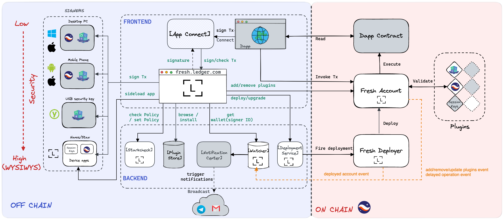

# Ledger Fresh Product Management

This repository is used to manage the Ledger Fresh product backlog and roadmap. Have a question about Ledger Fresh? [Talk to us](https://discord.com/channels/885256081289379850/1053266126953529374)

Here is a table listing all Ledger Fresh modules and their important links.

| Module       | Issues                                                                                                                   | Project                                                       | Repository                                                                    |
| ------------ | ------------------------------------------------------------------------------------------------------------------------ | ------------------------------------------------------------- | ----------------------------------------------------------------------------- |
| App Connect  | [link](https://github.com/LedgerHQ/ledger-fresh-management/issues?q=is%3Aopen+is%3Aissue+label%3Amodule%3Aapp_connect)   | [link](https://github.com/orgs/LedgerHQ/projects/36/views/11) | /                                                                             |
| Nano app     | [link](https://github.com/LedgerHQ/ledger-fresh-management/issues?q=is%3Aopen+is%3Aissue+label%3Amodule%3Anano_app)      | [link](https://github.com/orgs/LedgerHQ/projects/36/views/12) | [Nano App in Rust](https://github.com/LedgerHQ/nano-rapp-starknet)            |
| Notification | [link](https://github.com/LedgerHQ/ledger-fresh-management/issues?q=is%3Aopen+is%3Aissue+label%3Amodule%3Anotification)  | [link](https://github.com/orgs/LedgerHQ/projects/36/views/7)  | /                                                                             |
| On-chain     | [link](https://github.com/LedgerHQ/ledger-fresh-management/issues?q=is%3Aopen+is%3Aissue+label%3Amodule%3Aon-chain+)     | [link](https://github.com/orgs/LedgerHQ/projects/36/views/2)  | [Smart-Contract Account](https://github.com/LedgerHQ/starknet-plugin-account) |
| Plugin Store | [link](https://github.com/LedgerHQ/ledger-fresh-management/issues?q=is%3Aopen+is%3Aissue+label%3Amodule%3Aplugin_store+) | [link](https://github.com/orgs/LedgerHQ/projects/36/views/6)  | /                                                                             |
| Starkcheck   | [link](https://github.com/LedgerHQ/ledger-fresh-management/issues?q=is%3Aopen+is%3Aissue+label%3Amodule%3Astarkcheck)    | [link](https://github.com/orgs/LedgerHQ/projects/36/views/10) | [StarkCheck](https://github.com/LedgerHQ/StarkCheck)                          |
| Watcher      | [link](https://github.com/LedgerHQ/ledger-fresh-management/issues?q=is%3Aopen+is%3Aissue+label%3Amodule%3Awatcher+)      | [link](https://github.com/orgs/LedgerHQ/projects/36/views/8)  | /                                                                             |
| Web          | [link](https://github.com/LedgerHQ/ledger-fresh-management/issues?q=is%3Aopen+is%3Aissue+label%3Amodule%3Aweb)           | [link](https://github.com/orgs/LedgerHQ/projects/36/views/5)  | /                                                                             |

Here are some other links related to Ledger Fresh

- [Starknet Deployer - Proof of concept](https://github.com/LedgerHQ/Starknet-POC-deployer)
- [Starknet Client - Javascript](https://github.com/LedgerHQ/starknet-js-client/)

# Ledger Fresh

## Why Ledger Fresh?

Ledger Fresh (internal name) is Ledger’s Innovation Lab latest project. It is a flexible platform that aims to redefine and improve how users interact with their wallets.

Ledger Fresh leverages hardware wallets’s uncompromising security while delegating other safety checks that can run without any interaction to improve your experience.

With Ledger Fresh users will be able to interact with decentralized applications more seamlessly without needing to approve all transactions on their hardware device and without compromising on the security.

New users will also be able to immediately enter the Ledger ecosystem without a device or an application, just a smartphone, and gradually increase their security as their usage grows.

### How Ledger Plans To Improve Your Ledger Experience 

Ledger is built on world-class security. Smartcards are historic security technologies that we augmented to make them suitable for the Internet era in three ways: 

- By removing the need to have a card reader to use a smartcard - it can now be directly connected to the USB port of a computer or used over Bluetooth.

- By providing an open Operating System, BOLOS (Blockchain Open Ledger Operating System), letting developers load their own native code into the device and users pick applications from a thriving ecosystem.

- By adding a screen and buttons connected directly to the smartcard to prevent malware from changing the information displayed to the user or faking user consent, thus making sure that What You See Is What You Sign. 

While security will remain our North Star, we collected usage feedback about Ledger devices and found a few pain points.

1. Onboarding your Ledger Nano devices requires writing down a list of 12/24 words (the mnemonic) to backup the private cryptographic keys. This backup is critical to recover the assets if the device is lost and for interoperability with multiple wallets. As those words hold too much power and a high value, attackers are getting more and more creative to trick users into giving them.

2. When using a Ledger device, the user always performs the same actions regardless of the amount of the transaction. This can lead to fatigue and a lack of attention to details for more important transactions. 

3. As users spend more time using cryptocurrencies, they might want to move to different governance solutions (such as multi-signature) or plan for inheritance - this is complex and costly with current solutions as this requires moving all assets to a new wallet.

### A Smarter Wallet To Improve Your Experience

Those pain points could be solved by using a smarter wallet that can run its own independent logic, and let users freely customize part of this logic. Here are a few scenarios on how the different pain points we’ve just examined could be addressed.

1. The onboarding phase would let users register different devices to the smart wallet, and the recovery phrase would only be used once if all devices are lost, after giving notifications on all possible media and a grace period to cancel the operation to the user.

2. Different security profiles could be set in the smart wallet, ones for daily use cases and others for special/dedicated use cases. This could be done through allowlists or more complex policies linked to sources of truth operated offchain by the user.

3. The smart wallet logic would be updatable/upgradable on the fly, without having to move assets to a new wallet implementing new features.

We’ll see next how the Ledger Fresh wallet is this ultimate smart wallet and which technical components it is built from.

## The building blocks of Ledger Fresh: Account Abstraction, FIDO, Starknet & Account Plugins

### Account Abstraction

Account Abstraction is a long term goal of the Ethereum ecosystem to use the execution capabilities of a blockchain to implement the account verification logic instead of just implementing the logic of applications. Account Abstraction replaces the traditional concept of accounts associated with keys by account smart contracts,makingit possible to use custom verification logic (for example different signature schemes) and to perform additional checks such as using an allowlist of contracts and functions. 

It has been partially implemented on Ethereum, with [Argent](https://github.com/argentlabs) pioneering its use since 2018, and there are currently several competing specifications ([EIP-4337](https://eips.ethereum.org/EIPS/eip-4337), [EIP-3074](https://eips.ethereum.org/EIPS/eip-3074) and [EIP-5806](https://eips.ethereum.org/EIPS/eip-5806)) being reviewed to move to a full implementation, enabling for instance to pay for network fees using different assets (e.g any [ERC-20](https://eips.ethereum.org/EIPS/eip-20) token), or define how transactions are ordered.

Unfortunately even partial implementations of Account Abstraction didn’t get a lot of traction because of the related network costs, particularly when gas price surged during Defi Summer in 2020 and then during the NFT era in 2021.This is going to change with a growing range of efficient L2 solutions aiming at bringing down gas costs.

### FIDO / WebAuthn

In 2012, FIDO defined a web native protocol to use cryptographic signatures to replace common Second Factor Authentication (2FA) and One Time Password algorithms by using a shared secret. While not protecting users against malware, FIDO helps to solve phishing attacks as well as attacks targeting the server credentials database.

FIDO support was initially only provided by dedicated devices such as [Yubikeys](https://www.yubico.com/), but things got more interesting in 2019 when Apple and Google started including FIDO 2 (aka WebAuthn) support directly in their devices, with keys, signatures and authorizations backed by the hardware security features of the platform - [the Secure Enclave and Face ID](https://help.apple.com/pdf/security/en_US/apple-platform-security-guide.pdf) for Apple, [StrongBox and biometric authentication](https://developer.android.com/training/articles/keystore#HardwareSecurityModule) for Android

We now have a strong and reliable cryptographic authentication mechanism available on most smartphones that can be directly used from the browser.

It’d be great if this could be used as an everyday signer with additional restrictions in the user account contract - unfortunately verifying WebAuthn signatures on-chain is too costly since the only curve supported by the FIDO2 compliant hardware solutions is secp256r1, the neighbor of Ethereum secp256k1, which isn’t natively supported by most chains.

### Starknet

Starknet is a scalability second layer released in 2021 by Starkware. It allows to compute more expensive transactions on that layer and only submit a succinct proof of valid execution to be verified by the settlement layer of the rollup, Ethereum.

Given the substantial savings, Starknet uses an Account Abstraction model for all users. More interestingly, as Starknet execution model is not based on the Ethereum Virtual Machine, complex mathematical operations are also less expensive, and it is thus possible to implement a validation of WebAuthn signatures at the application level. This has been pioneered by [Cartridge](https://github.com/cartridge-gg).

Thanks to Starknet, we can run for an acceptable cost an Account Abstraction model with several devices that can authenticate to the account smart contract, including smartphones implementing WebAuthn in the browser.

### Account plugins

Account plugins are a flexible mechanism to extend an account smart contract logic with pluggable logic (plugin). The [reference implementation](https://github.com/argentlabs/starknet-plugin-account) is currently being worked on jointly by Argent, Cartridge and Ledger.

More specifically, Account plugins allow updating mechanisms to validate transactions on the fly. Also, different signing mechanisms (such as WebAuthn) or security schemes (such as reduced signature friction for games or social applications with [session keys](https://mirror.xyz/matchboxdao.eth/VXOvLKIvfXHP-cusKHw55zqlHpvvWwzh_fqm6j48Yek)) can be added to an account smart contract supporting the plugin architecture after it has been instantiated without having to move assets or create a new wallet.

## Ledger Fresh usage

Ledger Fresh builds a security oriented web wallet interface interacting with an account smart contract on Starknet supporting different security validation mechanisms (such as creating an allowlist or relying on an external source of truth) depending on the device interacting with the account: this can be for instance either a WebAuthn device, or a Ledger device. Moreover, this wallet can be enhanced/extended by external plugins.

Ledger Fresh is under heavy development and currently being developed by Ledger and the community (with the support of [Only Dust](https://www.onlydust.xyz/)), targeting a release for Starknet mainnet official launch, scheduled around end of Q1 2023. The security mechanisms and user flow described here are still being discussed and could change

### Without a Ledger device 

When starting her journey without a Ledger device, the user will be able to register different WebAuthn devices(your mobille phone, your laptop, …) to Ledger Fresh.

Ledger Fresh will provide additional guidance when an operation is risky or the user account value is significant enough to get protected against malware with a Ledger device.

Switching between security profiles or modifying the current security profile will be performed with a customizable delay and notifications to give users the opportunity to cancel the operation in case it was initiated by malware

### Adding a Ledger device 

Adding a Ledger device provides full protection against malware - thus security operations can be confirmed instantly on device (What You See Is What You Sign). The user will also be able to bypass security restrictions set to the account (for example a spent amount per day) if and only if using a Ledger device.

### Future Ledger Fresh services

In the future, we plan to extend the support of Ledger Fresh - both with connecting additional chains to Starknet, and to support the same concept on different chains if it is economically viable

Additional services will also be implemented as plugins, such as a multisignature service or a trustless legacy service allowing to send crypto assets to a predefined address if the account has been idle for some time.
